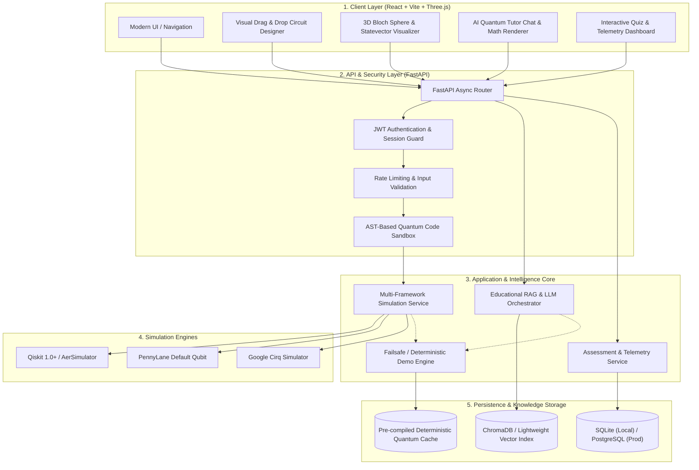

# System Architecture Document
## AI-Powered Interactive Quantum Algorithm Learning Platform (SIH 2026)

---

## 1. Executive System Overview

The **AI-Powered Interactive Quantum Algorithm Learning Platform** is an end-to-end educational web application engineered to bridge abstract quantum theory and hands-on algorithm experimentation. Designed specifically for the rigorous constraints of a national hackathon demonstration (Smart India Hackathon 2026), the platform integrates a visual drag-and-drop circuit designer, a multi-framework quantum simulation backend (Qiskit, PennyLane, Cirq), dynamic 3D state visualization (Bloch Sphere and statevectors), and an AI-powered conversational tutor backed by Retrieval-Augmented Generation (RAG).



---

## 2. Frontend Architecture

### 2.1 Technology Stack & Decisions
* **Framework**: React 18+ bootstrapped with Vite.
  * *Rationale*: Instant Hot Module Replacement (HMR), minimal bundle footprint (<300ms local startup), predictable client-side state transitions without server-side rendering (SSR) overhead.
* **Component Architecture**: Modular feature-based structure (`features/circuits`, `features/visualization`, `features/tutor`, `features/curriculum`).
* **State Management**: Lightweight Zustand store for shared application state (active circuit, simulation results, student profile) + React Context for theme and audio settings.
* **3D & Mathematical Rendering**:
  * **Three.js / React Three Fiber**: Powers interactive 3D rendering of the single-qubit Bloch Sphere with animated statevector rotations and phase angles.
  * **KaTeX**: Zero-dependency, ultra-fast client-side LaTeX equation rendering for Dirac bra-ket notations ($\lvert \psi \rangle$, $\langle \phi \rvert$) and gate transformation matrices.
  * **Chart.js / Plotly.js**: Dynamic measurement histogram rendering displaying shot frequencies and probability distributions.

### 2.2 Client-Side Modular Layout
```
frontend/src/
├── assets/                  # Vector icons, SVG gates, educational diagrams
├── components/common/       # Reusable UI primitives (Buttons, Modals, Cards, Nav)
├── features/
│   ├── circuit-designer/    # Interactive drag-drop grid, gate palette, QASM/Python exporter
│   ├── visualization/       # Three.js Bloch Sphere, 2D probability bars, statevector compass
│   ├── ai-tutor/            # Chat interface, streaming markdown, KaTeX math formatter
│   ├── curriculum/          # Guided interactive theory chapters (Qubits -> Grover)
│   └── assessment/          # Real-time quizzes, coding challenges, scorecard
├── services/                # Axios/Fetch API client wrappers with automated interceptors
├── store/                   # Zustand global stores (circuitStore, userStore, simStore)
└── types/                   # TypeScript interfaces matching backend API contracts
```

---

## 3. Backend Architecture

### 3.1 Framework: FastAPI (Python 3.11+)
* **High-Concurrency Async Core**: Asynchronous ASGI server (Uvicorn) handling concurrent simulation requests and streaming AI tokens.
* **Type Safety & Automatic Documentation**: Strict Pydantic v2 schemas for all request payloads and response envelopes. OpenAPI (Swagger UI) available at `/docs` for instantaneous cross-team contract validation.

### 3.2 Backend Modular Structure
```
backend/
├── app/
│   ├── api/v1/
│   │   ├── endpoints/
│   │   │   ├── auth.py          # Student signup, login, JWT token dispatch
│   │   │   ├── simulation.py    # Multi-engine quantum circuit execution
│   │   │   ├── ai_tutor.py      # RAG conversational endpoint with streaming fallback
│   │   │   ├── curriculum.py    # Structured modules, lessons, and interactive examples
│   │   │   ├── assessment.py    # Quizzes, challenges, and auto-grader
│   │   │   └── telemetry.py     # Student mastery metrics and progress tracking
│   │   └── router.py            # Aggregate v1 API router
│   ├── core/
│   │   ├── config.py            # Pydantic BaseSettings loading from .env
│   │   ├── security.py          # Password hashing (bcrypt), JWT encoder/decoder
│   │   └── sandbox.py           # Abstract Syntax Tree (AST) code validator
│   ├── db/
│   │   ├── session.py           # SQLAlchemy session factory (SQLite/PostgreSQL)
│   │   └── base.py              # Declarative Base and model registry
│   ├── models/                  # SQLAlchemy ORM database models
│   ├── schemas/                 # Pydantic schemas for request/response serialization
│   ├── services/
│   │   ├── quantum/             # Simulation drivers (Qiskit, PennyLane, Cirq)
│   │   ├── ai/                  # RAG pipeline, vector store wrapper, LLM orchestrator
│   │   └── fallback/            # Deterministic static demo provider
│   └── main.py                  # FastAPI application entrypoint and middleware
├── data/
│   ├── curriculum/              # Markdown/JSON textbook vectors and lesson text
│   ├── cached_simulations/      # Pre-calculated statevectors & histograms for demo
│   └── vector_store/            # ChromaDB local index persistence
├── tests/                       # Pytest test suite (unit, integration, quantum verification)
└── requirements.txt             # Pinned production dependencies
```

---

## 4. Quantum Simulation Engine & Multi-Framework Architecture

### 4.1 Unified Circuit Intermediate Representation (CIR)
To support Qiskit, PennyLane, and Cirq without coupling the frontend to a single proprietary SDK, the platform defines a vendor-agnostic JSON Circuit Representation:
```json
{
  "num_qubits": 2,
  "num_clbits": 2,
  "instructions": [
    { "gate": "h", "qubits": [0], "params": [] },
    { "gate": "cx", "qubits": [0, 1], "params": [] },
    { "gate": "measure", "qubits": [0, 1], "clbits": [0, 1] }
  ]
}
```

### 4.2 Abstract Simulation Interface
A uniform Python adapter pattern decouples the execution engines:
```python
class BaseQuantumSimulator(ABC):
    @abstractmethod
    def execute(self, circuit: CircuitSchema, shots: int) -> SimulationResult:
        pass

    @abstractmethod
    def compute_statevector(self, circuit: CircuitSchema) -> StatevectorResult:
        pass
```
* **Qiskit Engine (`QiskitSimulator`)**: Built on modern Qiskit 1.0+ with `qiskit-aer`'s `AerSimulator`. Supports statevector extraction, shot-based sampling, and OpenQASM 2.0/3.0 export.
* **PennyLane Engine (`PennyLaneSimulator`)**: Utilizes `default.qubit` device. Ideal for demonstrating parameterized quantum circuits (VQE and QAOA optimization landscapes).
* **Cirq Engine (`CirqSimulator`)**: Compiles native `cirq.Circuit` objects; demonstrates multi-vendor quantum interoperability.

### 4.3 AST-Based Safe Execution Sandbox
> [!CAUTION]
> **Anti-Remote Code Execution (RCE) Principle**:
> Direct execution of arbitrary user-submitted Python strings via `eval()` or `exec()` is strictly prohibited.
> 
> When users write raw Python scripts in the Code View:
> 1. An AST parser (`ast.NodeVisitor`) verifies that imports are strictly restricted to `qiskit`, `pennylane`, `cirq`, and `numpy`.
> 2. Forbidden functions (`os`, `sys`, `subprocess`, `open`, `__import__`, `eval`) are blocked at parse time.
> 3. Execution runs within an isolated subprocess enforced with a strict 10-second timeout and memory cap (512 MB).

---

## 5. AI Tutor & Educational RAG Architecture

### 5.1 Hybrid RAG Pipeline
1. **Document Ingestion**: Curriculum reference textbooks, quantum gate reference sheets, and standard algorithm proofs are segmented into 500-token chunks with 50-token overlap.
2. **Embedding Model**: Fast, lightweight local sentence-transformers (`all-MiniLM-L6-v2`) executing purely on CPU without requiring GPU hardware or cloud API latency.
3. **Vector Database**: ChromaDB (embedded local mode) or FAISS for sub-millisecond semantic retrieval.
4. **Prompt Orchestrator**: Injects retrieved quantum context into a strictly structured system prompt enforcing:
   - Plain-language conceptual summaries.
   - Exact mathematical LaTeX equations.
   - Runnable code snippets.
   - Targeted comprehension questions.

### 5.2 Deterministic Failsafe Fallback
If the venue Wi-Fi fails or the cloud LLM provider exhausts its quota:
* The backend intercepts the timeout (`HTTPException` / `ConnectionError`).
* It routes the query through the **Offline Intelligence Engine**, which performs exact and fuzzy keyword matching against pre-computed responses for the primary SIH demo curriculum (Superposition, Bell State, Deutsch-Jozsa, Grover's Algorithm, VQE).
* A subtle badge on the UI displays `Mode: Offline Verified Cache`, guaranteeing a flawless, uninterrupted live presentation.

---

## 6. Quantum State & Visualization Architecture

### 6.1 3D Bloch Sphere
* Calculates spherical coordinates from qubit state amplitudes:
  $$\lvert \psi \rangle = \cos(\theta/2)\lvert 0 \rangle + e^{i\phi}\sin(\theta/2)\lvert 1 \rangle$$
  $$x = \sin\theta\cos\phi, \quad y = \sin\theta\sin\phi, \quad z = \cos\theta$$
* Renders the unit sphere in Three.js with pole indicators $\lvert 0 \rangle, \lvert 1 \rangle$, equatorial axes, and an animated vector pointing to $(x, y, z)$.

### 6.2 Multi-Qubit Statevector & Density Display
* For $n$-qubit systems ($n \le 4$), computes the $2^n$ complex state amplitudes ($c_k = a_k + i b_k$).
* Displays magnitude squared $|c_k|^2$ as probabilities and phase angle $\arg(c_k)$ as color hue / phase dial.

### 6.3 Measurement Probability Histograms
* Aggregates simulation shots (default 1024) into binary bitstring frequencies (`"00"`, `"11"`).
* Interactive hover reveals theoretical vs. sampled probability distributions.

---

## 7. Database & Persistence Architecture

* **Development & Hackathon Demo**: SQLite (`quantum_platform.db`) — zero configuration, zero external service dependency, instant cold start.
* **Production**: PostgreSQL 16+ via async SQLAlchemy and Alembic migrations.
* **Data Models**:
  - `User`: Credentials, profile, role.
  - `CurriculumModule`: Module metadata and ordering.
  - `Lesson`: Theoretical content, pre-configured circuit template.
  - `Circuit`: User-saved circuits, gate layout JSON.
  - `SimulationRun`: Historic execution telemetry, shots, backend used, execution duration.
  - `Quiz`: Assessment questions, options, explanation.
  - `StudentProgress`: Completed lessons, quiz scores, algorithm mastery levels.

---

## 8. Security & Operational Reliability

1. **Authentication**: Stateless JSON Web Tokens (JWT) using `HS256` signed with a secure secret key; tokens stored in secure local storage / HTTP-only cookies.
2. **CORS Enforcement**: Whitelisted local frontend origins (`http://localhost:5173`, `http://localhost:3000`).
3. **Data Validation**: Strict Pydantic validation on all incoming JSON bodies prevents injection attacks.
4. **Environment Isolation**: All configuration keys (database URLs, LLM tokens) read strictly from `.env` via `pydantic-settings`; `.env` is permanently excluded via `.gitignore`.
