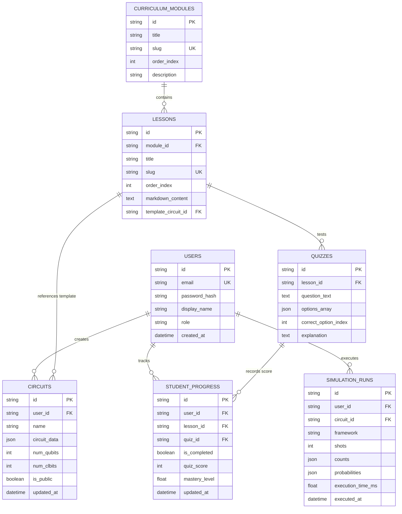

# Database Schema & Data Models Specification
## AI-Powered Interactive Quantum Algorithm Learning Platform (SIH 2026)

---

## 1. Schema Design Principles

The database architecture is designed with **dual compatibility**:
1. **SQLite (`quantum_platform.db`)**: Used during local development and for the offline SIH hackathon demonstration. It requires zero server setup, runs in-process with zero network overhead, and has zero external dependencies.
2. **PostgreSQL 16+**: The target production database supported out-of-the-box via SQLAlchemy ORM without altering table definitions.

Circuit definitions and simulation results utilize native JSON fields (`JSON` in SQLite/Postgres) to provide complete flexibility for arbitrary circuit topologies without requiring complex relational joins on gate parameters.

---

## 2. Entity-Relationship Diagram (ERD)



---

## 3. Detailed Table Definitions (SQL DDL)

### 3.1 Users (`users`)
```sql
CREATE TABLE users (
    id VARCHAR(36) PRIMARY KEY,
    email VARCHAR(255) NOT NULL UNIQUE,
    password_hash VARCHAR(255) NOT NULL,
    display_name VARCHAR(100) NOT NULL,
    role VARCHAR(20) NOT NULL DEFAULT 'student',
    created_at TIMESTAMP WITH TIME ZONE DEFAULT CURRENT_TIMESTAMP,
    updated_at TIMESTAMP WITH TIME ZONE DEFAULT CURRENT_TIMESTAMP
);
CREATE INDEX idx_users_email ON users(email);
```

### 3.2 Curriculum Modules (`curriculum_modules`)
```sql
CREATE TABLE curriculum_modules (
    id VARCHAR(36) PRIMARY KEY,
    title VARCHAR(200) NOT NULL,
    slug VARCHAR(100) NOT NULL UNIQUE,
    order_index INTEGER NOT NULL DEFAULT 0,
    description TEXT,
    created_at TIMESTAMP WITH TIME ZONE DEFAULT CURRENT_TIMESTAMP
);
CREATE INDEX idx_modules_order ON curriculum_modules(order_index);
```

### 3.3 Lessons (`lessons`)
```sql
CREATE TABLE lessons (
    id VARCHAR(36) PRIMARY KEY,
    module_id VARCHAR(36) NOT NULL REFERENCES curriculum_modules(id) ON DELETE CASCADE,
    title VARCHAR(200) NOT NULL,
    slug VARCHAR(100) NOT NULL UNIQUE,
    order_index INTEGER NOT NULL DEFAULT 0,
    markdown_content TEXT NOT NULL,
    template_circuit_id VARCHAR(36),
    created_at TIMESTAMP WITH TIME ZONE DEFAULT CURRENT_TIMESTAMP
);
CREATE INDEX idx_lessons_module_order ON lessons(module_id, order_index);
```

### 3.4 Quantum Circuits (`circuits`)
```sql
CREATE TABLE circuits (
    id VARCHAR(36) PRIMARY KEY,
    user_id VARCHAR(36) REFERENCES users(id) ON DELETE SET NULL,
    name VARCHAR(200) NOT NULL,
    num_qubits INTEGER NOT NULL CHECK (num_qubits BETWEEN 1 AND 16),
    num_clbits INTEGER NOT NULL DEFAULT 0,
    circuit_data JSON NOT NULL,
    is_public BOOLEAN NOT NULL DEFAULT FALSE,
    created_at TIMESTAMP WITH TIME ZONE DEFAULT CURRENT_TIMESTAMP,
    updated_at TIMESTAMP WITH TIME ZONE DEFAULT CURRENT_TIMESTAMP
);
CREATE INDEX idx_circuits_user ON circuits(user_id);
```

### 3.5 Simulation Runs (`simulation_runs`)
```sql
CREATE TABLE simulation_runs (
    id VARCHAR(36) PRIMARY KEY,
    user_id VARCHAR(36) REFERENCES users(id) ON DELETE SET NULL,
    circuit_id VARCHAR(36) REFERENCES circuits(id) ON DELETE SET NULL,
    framework VARCHAR(50) NOT NULL,
    shots INTEGER NOT NULL,
    counts JSON NOT NULL,
    probabilities JSON NOT NULL,
    execution_time_ms REAL NOT NULL,
    executed_at TIMESTAMP WITH TIME ZONE DEFAULT CURRENT_TIMESTAMP
);
CREATE INDEX idx_sim_runs_user ON simulation_runs(user_id);
CREATE INDEX idx_sim_runs_circuit ON simulation_runs(circuit_id);
```

### 3.6 Quizzes (`quizzes`)
```sql
CREATE TABLE quizzes (
    id VARCHAR(36) PRIMARY KEY,
    lesson_id VARCHAR(36) REFERENCES lessons(id) ON DELETE CASCADE,
    question_text TEXT NOT NULL,
    options_array JSON NOT NULL,
    correct_option_index INTEGER NOT NULL,
    explanation TEXT NOT NULL,
    created_at TIMESTAMP WITH TIME ZONE DEFAULT CURRENT_TIMESTAMP
);
CREATE INDEX idx_quizzes_lesson ON quizzes(lesson_id);
```

### 3.7 Student Progress (`student_progress`)
```sql
CREATE TABLE student_progress (
    id VARCHAR(36) PRIMARY KEY,
    user_id VARCHAR(36) NOT NULL REFERENCES users(id) ON DELETE CASCADE,
    lesson_id VARCHAR(36) REFERENCES lessons(id) ON DELETE CASCADE,
    quiz_id VARCHAR(36) REFERENCES quizzes(id) ON DELETE SET NULL,
    is_completed BOOLEAN NOT NULL DEFAULT FALSE,
    quiz_score INTEGER DEFAULT 0,
    mastery_level REAL DEFAULT 0.0,
    updated_at TIMESTAMP WITH TIME ZONE DEFAULT CURRENT_TIMESTAMP,
    CONSTRAINT uq_user_lesson UNIQUE (user_id, lesson_id)
);
CREATE INDEX idx_progress_user ON student_progress(user_id);
```

---

## 4. Migration & Seeding Strategy

1. **Alembic ORM Migrations**: Managed via `backend/alembic/` to cleanly evolve schemas as new quantum algorithm models are introduced.
2. **Deterministic Seed Data (`seed_curriculum.py`)**: Automatically populates the 6 core SIH curriculum modules:
   * Module 1: Fundamental Qubits & Superposition
   * Module 2: Quantum Gates & Bloch Sphere Rotations
   * Module 3: Two-Qubit Systems & Entanglement (Bell States)
   * Module 4: Oracle Algorithms (Deutsch-Jozsa)
   * Module 5: Quantum Search (Grover's Algorithm)
   * Module 6: Variational Quantum Eigensolver (VQE Introduction)
