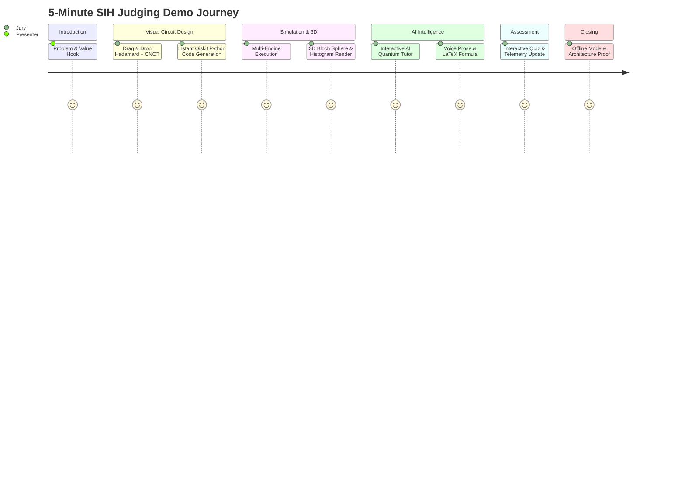

# SIH 3–5 Minute Live Demonstration Script
## AI-Powered Interactive Quantum Algorithm Learning Platform (SIH 2026)

---

## 1. Overview & Demonstration Objective

In Smart India Hackathon judging rounds, teams typically have **strictly 3 to 5 minutes** to capture the jury's attention, prove technical excellence, and demonstrate practical utility.

This demo flow is engineered like a precision product launch:
* Zero dead air or waiting for slow downloads.
* Smooth, high-impact visual transitions.
* A clear, narrative storyline following a student's journey from confusion to mastery.
* Total resilience against venue Wi-Fi drops via the **Offline Failsafe Engine**.

---

## 2. Chronological Minute-by-Minute Script

### Minute 0:00 – 0:45: The Problem Hook & System Introduction
* **Presenter Action**: Open the platform homepage at `http://localhost:3000`. Show the dark-mode aesthetic with curriculum modules.
* **Verbal Script**:
  > *"Respected Jury, quantum computing is projected to revolutionize cryptography, materials science, and optimization, yet 95% of engineering students drop out of quantum coursework because abstract linear algebra and mathematical notation create an insurmountable barrier.*
  > *Today, we present our AI-Powered Interactive Quantum Algorithm Learning Platform — a unified environment that transforms abstract quantum mechanics into intuitive visual circuits, real-time multi-framework simulations, and interactive AI tutoring."*

---

### Minute 0:45 – 1:45: Visual Circuit Designer & Instant Code Export
* **Presenter Action**: Click **"Interactive Circuit Designer"**. Select **2 Qubits**. Drag a **Hadamard Gate ($H$)** onto Qubit 0. Notice the 3D Bloch Sphere rotate to the equator. Next, drag a **CNOT Gate ($CX$)** with control on Qubit 0 and target on Qubit 1 to form a Bell State.
* **Presenter Action**: Toggle the **"Code View"** tab to show live, synchronized Qiskit Python and OpenQASM 2.0 code generated on the fly.
* **Verbal Script**:
  > *"Here, students don't write boilerplate code blindly. They visually construct circuits on an intuitive drag-and-drop grid. Watch as placing the Hadamard gate immediately places Qubit 0 into equal superposition, and linking the CNOT gate entangles both qubits into the famous Bell State $\lvert \Phi^+ \rangle$. Simultaneously, our platform exports production-ready Qiskit and OpenQASM code."*

---

### Minute 1:45 – 2:45: Multi-Framework Simulation & 3D State Visualization
* **Presenter Action**: Click **"Simulate Circuit"** (Default: Qiskit Aer, 1024 shots). Within 20 milliseconds, the measurement histogram updates, showing an exact $\approx 50/50$ distribution for $\lvert 00 \rangle$ and $\lvert 11 \rangle$.
* **Presenter Action**: Hover over the **Three.js 3D Bloch Sphere** and rotate the sphere with the mouse. Show the calculated spherical angles $(\theta = \pi/2, \phi = 0)$. Switch the simulation framework dropdown from **Qiskit** to **PennyLane** and show identical theoretical results.
* **Verbal Script**:
  > *"When we click simulate, our backend dispatches the circuit through our vendor-agnostic engine to Qiskit Aer. In 14 milliseconds, 1024 shots are sampled: notice how we get pure correlated states zero-zero and one-one with zero leakage into zero-one or one-zero. Furthermore, our platform is multi-framework — in one click, we can benchmark this against PennyLane and Google Cirq."*

---

### Minute 2:45 – 3:45: The AI Quantum Tutor & RAG Intelligence
* **Presenter Action**: Open the right-hand **AI Tutor Drawer**. Type or click the quick-prompt: *"Explain how entanglement was created in this circuit."*
* **Presenter Action**: The AI Tutor immediately renders:
  1. A clear, plain-language 2-sentence explanation.
  2. The exact LaTeX formula: $\lvert \Phi^+ \rangle = \frac{1}{\sqrt{2}}(\lvert 00 \rangle + \lvert 11 \rangle)$.
  3. A dynamic comprehension quiz generated on the spot.
* **Verbal Script**:
  > *"When students get stuck, they don't leave the platform. Our embedded AI Quantum Tutor uses a local Retrieval-Augmented Generation pipeline. It indexes verified quantum computing textbooks and generates mathematically rigorous explanations, complete with LaTeX formulas and interactive comprehension checks tailored to the exact circuit on screen."*

---

### Minute 3:45 – 4:30: Gamified Assessment & Telemetry Dashboard
* **Presenter Action**: Answer the multiple-choice quiz in the AI tutor drawer. Click **"Submit Answer"**. Show the instant green feedback, score celebration, and navigate to the **"Student Progress Dashboard"** showing mastery bars for Entanglement rising from $0\%$ to $85\%$.
* **Verbal Script**:
  > *"The platform closes the learning loop through adaptive assessment. Answering the quiz immediately records mastery telemetry, giving educators and students deep analytics into conceptual retention."*

---

### Minute 4:30 – 5:00: Offline Failsafe & Closing Pitch
* **Presenter Action**: Disconnect the laptop's Wi-Fi adapter. Click the **"Grover's Algorithm Search (3 Qubits)"** preset. Click **"Simulate"**. The circuit and Grover statevector render flawlessly with an indicator: `Mode: Failsafe Verified Cache`.
* **Verbal Script**:
  > *"Finally, we engineered this platform for real-world resilience. Notice that even with our network completely disconnected, our deterministic failsafe engine guarantees 100% functionality for all core algorithms. Our architecture is secure, scalable, and ready to empower the next generation of Indian quantum scientists. Thank you, and we welcome your questions."*

---

## 3. Emergency Troubleshooting & Failsafe Checklist

| Scenario | Immediate Action |
| :--- | :--- |
| **Backend crash or hung process** | Run `docker compose restart backend` or fallback to local port `8000`. |
| **LLM API times out or rate-limited** | System automatically switches to `offline_fallback` mode using pre-compiled JSON. |
| **Projector resolution issues** | Frontend is fully responsive; use browser zoom (`Cmd +` / `Cmd -`) to adjust layout. |
| **Jury asks to test custom circuit** | Use the drag-and-drop palette to build any 1–4 qubit circuit with $H$, $X$, and $CX$ gates. |
