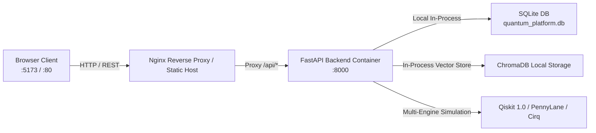

# Deployment & Infrastructure Guide
## AI-Powered Interactive Quantum Algorithm Learning Platform (SIH 2026)

---

## 1. Deployment Architecture

The platform is designed to be fully containerized using **Docker** and orchestrated via **Docker Compose**. It can be deployed in two modes:
1. **Local Hackathon Demonstration Mode**: Everything runs locally on the presentation laptop inside lightweight containers with SQLite and local vector store. Zero internet required.
2. **Cloud Production Mode**: Can be deployed to AWS/GCP/DigitalOcean or platform-as-a-service providers (Render, Railway, Fly.io) with a managed PostgreSQL database.



---

## 2. Docker Compose Orchestration (`docker-compose.yml`)

```yaml
version: '3.8'

services:
  backend:
    build:
      context: .
      dockerfile: Dockerfile
    container_name: quantum_backend
    restart: unless-stopped
    ports:
      - "8000:8000"
    environment:
      - ENVIRONMENT=production
      - PORT=8000
      - DATABASE_URL=sqlite:///./quantum_platform.db
      - LLM_PROVIDER=offline_fallback
      - ENABLE_FAILSAFE_CACHE=true
    volumes:
      - ./data:/app/data
      - ./quantum_platform.db:/app/quantum_platform.db
    healthcheck:
      test: ["CMD", "curl", "-f", "http://localhost:8000/api/v1/health"]
      interval: 30s
      timeout: 10s
      retries: 3
      start_period: 15s

  frontend:
    build:
      context: ./frontend
      dockerfile: Dockerfile
    container_name: quantum_frontend
    restart: unless-stopped
    ports:
      - "3000:80"
    depends_on:
      - backend
```

---

## 3. Production Dockerfile Configuration

### Multi-Stage Backend Dockerfile (`Dockerfile`)
```dockerfile
# Stage 1: Build & Dependencies
FROM python:3.11-slim as builder

WORKDIR /app
ENV PYTHONDONTWRITEBYTECODE=1 \
    PYTHONUNBUFFERED=1

RUN apt-get update && apt-get install -y --no-install-recommends \
    build-essential \
    curl \
    && rm -rf /var/lib/apt/lists/*

COPY requirements.txt .
RUN pip install --no-cache-dir --user -r requirements.txt

# Stage 2: Final Runtime (Minimal, Secure, Non-Root)
FROM python:3.11-slim

WORKDIR /app
ENV PYTHONDONTWRITEBYTECODE=1 \
    PYTHONUNBUFFERED=1 \
    PATH=/root/.local/bin:$PATH \
    PORT=8000

# Install runtime curl for healthchecks
RUN apt-get update && apt-get install -y --no-install-recommends \
    curl \
    && rm -rf /var/lib/apt/lists/*

# Copy installed Python packages from builder
COPY --from=builder /root/.local /root/.local

# Copy application source code
COPY . .

# Create non-root user for security
RUN useradd -m -u 1000 appuser && chown -R appuser:appuser /app
USER appuser

EXPOSE 8000

CMD ["uvicorn", "backend.app.main:app", "--host", "0.0.0.0", "--port", "8000"]
```

---

## 4. Quick-Start Local Run Commands

```bash
# 1. Clone repository
git clone https://github.com/saketsumanai/Quantum-Project.git
cd Quantum-Project

# 2. Copy environment template
cp .env.example .env

# 3. Start complete platform via Docker
docker compose up --build -d

# 4. Verify deployment health
curl http://localhost:8000/api/v1/health

# 5. Access application:
# Frontend: http://localhost:3000
# Backend API Docs: http://localhost:8000/docs
```
