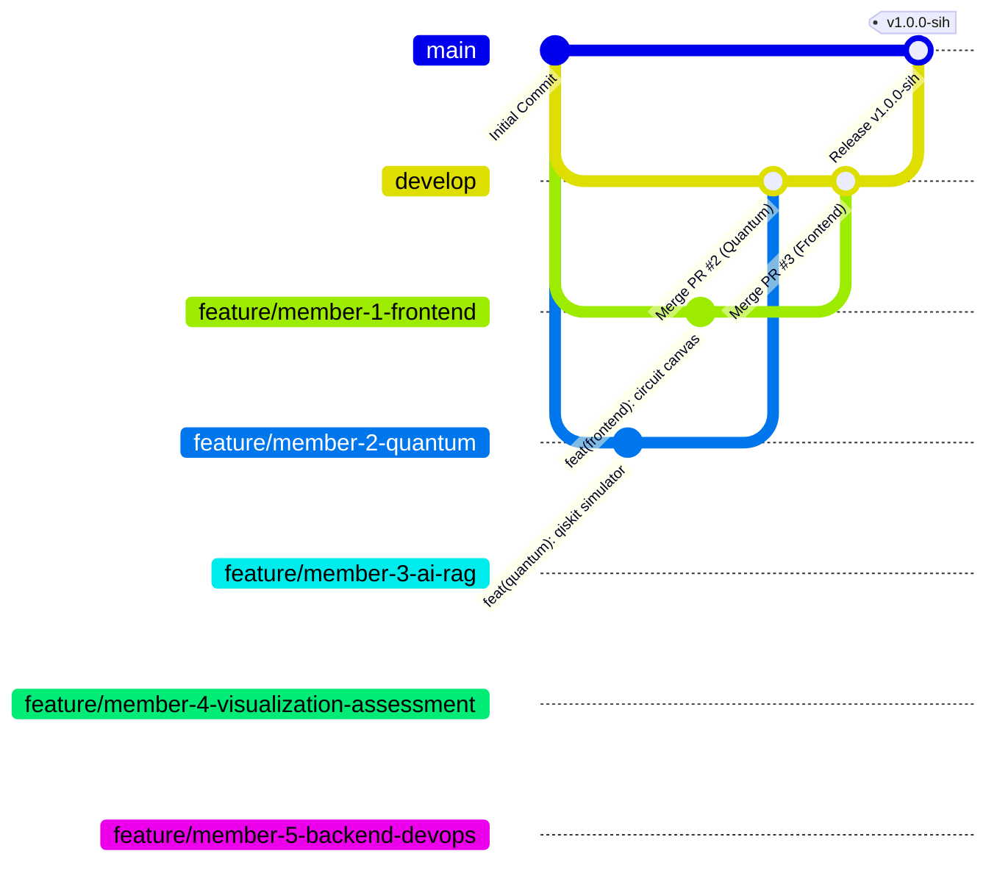

# Git Workflow & Collaboration Protocol
## AI-Powered Interactive Quantum Algorithm Learning Platform (SIH 2026)

---

## 1. Core Branching Strategy

To guarantee that 5 developers can commit and push simultaneously without overwriting each other's code or breaking the live demonstration, the repository follows a strict Git flow:



### 1.1 Branch Classifications
1. **`main` (Protected)**:
   - Contains ONLY tested, demo-ready, verified code.
   - Direct pushes to `main` are strictly prohibited.
   - Deploys automatically to production / demo staging.
2. **`develop` (Integration Trunk)**:
   - The primary integration branch where feature branches are merged after passing review and automated tests.
3. **Dedicated Feature Branches**:
   - `feature/member-1-frontend` (Prateek Raj)
   - `feature/member-2-quantum` (Jayesh Kapoor)
   - `feature/member-3-ai-rag` (Manas Thakur)
   - `feature/member-4-visualization-assessment` (Apurva Sinha)
   - `feature/member-5-backend-devops` (Saket Suman)
4. **Documentation / Release Branches**:
   - `docs/project-roadmap` (Initial roadmap and architectural documentation)
   - `hotfix/<issue>` (Critical bug fixes during the hackathon)

---

## 2. Conventional Commit Standards

All commit messages must adhere to the **Conventional Commits** specification:
```
<type>(<scope>): <short imperative summary>

[optional body explaining context and rationale]

[optional footer referencing task ID]
```

### 2.1 Permitted Types
* `feat`: A new user-facing capability or API feature (e.g., `feat(quantum): add multi-framework Cirq simulation adapter`)
* `fix`: A bug fix (e.g., `fix(circuit): prevent duplicate gate placement on identical time step`)
* `docs`: Documentation changes only (e.g., `docs: add API contracts and testing strategy`)
* `refactor`: Code change that neither fixes a bug nor adds a feature (e.g., `refactor(ai): modularize vector retrieval pipeline`)
* `test`: Adding missing tests or correcting existing tests (e.g., `test(quantum): add Bell state measurement unit test`)
* `chore`: Build process, package updates, or tooling configuration (e.g., `chore: update dependencies in requirements.txt`)
* `perf`: A code change that improves performance (e.g., `perf(vis): optimize Three.js render loop to 60fps`)

---

## 3. Pull Request (PR) & Review Process

1. **Before Opening a PR**:
   - Pull the latest `develop` into your feature branch:
     ```bash
     git checkout feature/member-X-name
     git pull origin develop
     ```
   - Run the automated test suite locally:
     ```bash
     pytest tests/
     npm test # for frontend
     ```
2. **Opening the PR**:
   - Target branch must always be `develop` (never `main`).
   - Title must match the primary conventional commit (e.g., `feat(quantum): implement Qiskit 1.0 simulation engine`).
   - Fill out the PR template:
     ```markdown
     ## Summary
     Explain what this PR introduces and why.

     ## Tasks Completed
     - [x] TSK-05: Qiskit simulation driver implemented.

     ## Testing Performed
     - Run `pytest tests/test_quantum_engines.py` (all passed).
     - Verified execution counts for Bell State.

     ## Screenshots / Recordings
     (Attach if UI changes were made)
     ```
3. **Review & Approval**:
   - At least one peer review is required.
   - Lead Engineer (Saket Suman) conducts final merge into `develop`.

---

## 4. Conflict Resolution & Merge Order

To eliminate integration collisions, merges into `develop` follow a strictly ordered dependency sequence:
1. **Tier 1 (Foundation)**: Member 5 (`backend-devops`) merges API contracts, database models, and mock routing.
2. **Tier 2 (Core Logic)**:
   - Member 2 (`quantum`) merges simulation engines.
   - Member 3 (`ai-rag`) merges RAG vector pipeline.
3. **Tier 3 (Client Layer)**:
   - Member 4 (`visualization-assessment`) merges 3D Bloch sphere & charts.
   - Member 1 (`frontend`) merges Circuit Designer and connects UI to Tier 2 & Tier 3 services.
4. **Tier 4 (Final Polish)**: Hotfixes, styling polish, and pre-computed demo caches.

---

## 5. Security & Zero-Secret Policy

> [!CRITICAL]
> **Zero Secrets Policy**:
> 1. NEVER commit API keys (OpenAI, Gemini, Groq), database passwords, or JWT secrets to Git.
> 2. Always verify `.gitignore` contains `.env`, `*.db`, and `venv/`.
> 3. If a secret is accidentally committed:
>    - Immediately revoke the key in the provider dashboard.
>    - Run `git rm --cached <file>` and overwrite the commit history before pushing.
