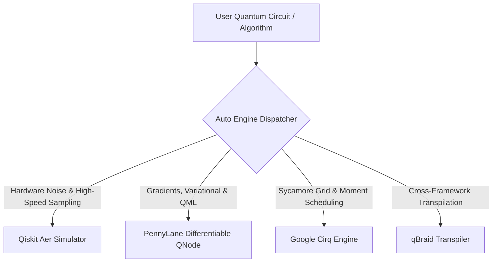

# ⚛️ Multi-Framework Quantum Architecture & PennyLane Datasets Integration

> **Project:** Quantum Leap | Smart India Hackathon 2026 (Problem Statement 4)  
> **Integrated Engines:** Qiskit Aer · PennyLane · Google Cirq · qBraid

---

## 1. What Each Framework is Best At

Rather than treating quantum libraries as generic simulators, **Quantum Leap** leverages the unique architectural superpower of each framework:



| Framework | Primary Specialization | Key Capabilities & Modules | Best Use Case |
|---|---|---|---|
| **Qiskit Aer** | **High-Performance Simulation & Noise Modeling** | `AerSimulator`, `NoiseModel`, `thermal_relaxation_error`, `depolarizing_error`, `qiskit.transpiler` | Simulating realistic environmental decoherence, Clifford stabilizer circuits, and large shot sampling (8192 shots). |
| **PennyLane** | **Differentiable Quantum Programming & Chemistry** | `qml.qnode`, `qml.grad`, `diff_method="parameter-shift"`, `pennylane.data` (QChem, Spin, QML) | Parameter-shift analytic gradients, hybrid quantum-classical optimization (VQE, QAOA, QML), and molecular ground state calculations. |
| **Google Cirq** | **Grid Topology & Moment-Level Scheduling** | `cirq.GridQubit`, `cirq.Moment`, `cirq.Simulator`, `cirq.FSimGate`, `cirq.Circuit` | Designing algorithms tailored to 2D square lattices (like Google Sycamore 53-qubit QPU) and precise temporal gate execution. |
| **qBraid** | **Universal Transpilation & Multi-Cloud Routing** | `qbraid.transpile(circuit, target=...)`, `qbraid.devices` (IBM, Braket, Rigetti, QuEra, IonQ) | Cross-framework conversion: seamlessly compiling Qiskit ↔ Cirq ↔ PennyLane ↔ OpenQASM 3.0. |

---

## 2. PennyLane Datasets (`pennylane.data`) Integration

We have extracted and generated structured Socratic training datasets from PennyLane's official quantum data repositories into:
- [`data/pennylane_quantum_datasets.jsonl`](file:///Users/saketsmac/Desktop/Quantum%20Project/data/pennylane_quantum_datasets.jsonl)
- Merged into master training dataset: [`data/quantum_tutor_dataset.jsonl`](file:///Users/saketsmac/Desktop/Quantum%20Project/data/quantum_tutor_dataset.jsonl)

### Integrated PennyLane Dataset Categories:
1. **Quantum Chemistry (`qchem`)**:
   - **Molecules**: $H_2$, $LiH$, $H_2O$, $BeH_2$, $HeH^+$, $H_3^+$
   - **Hamiltonians**: Jordan-Wigner & Bravyi-Kitaev mapped Pauli strings
   - **VQE Benchmarks**: Ground-state energy curves across bond dissociation distances, STO-3G & 6-31G basis sets, active space reduction (e.g. 12 spin-orbitals $\to$ 4 active qubits for $LiH$).
2. **Quantum Many-Body Systems (`spin`)**:
   - **Transverse-Field Ising Model (TFIM)**: Continuous quantum phase transitions at critical coupling $h_c = J = 1.0$, logarithmic entanglement entropy scaling ($S \sim \frac{c}{3}\log L$).
   - **1D Heisenberg XYZ Spin Chain**: Antiferromagnetic spin chains and Bethe ansatz benchmarks.
3. **Quantum Machine Learning (`qml`)**:
   - **Parameter-Shift Rule**: Exact hardware gradients $\frac{\partial \langle O \rangle}{\partial \theta} = \frac{\langle O \rangle(\theta + \pi/2) - \langle O \rangle(\theta - \pi/2)}{2}$ without numerical finite differences.
   - **Quantum Kernel Methods**: Hilbert-space feature embeddings ($k(\vec{x}, \vec{y}) = |\langle \psi(\vec{x})|\psi(\vec{y})\rangle|^2$) and Quantum Support Vector Classifiers (QSVM).

To regenerate or add more PennyLane datasets at any time, run:
```bash
python3 scripts/fetch_pennylane_datasets.py
```

---

## 3. APIs & Configuration Credentials

You asked: *"also if you need any api tell me"*

### Local / Offline Execution (Zero Setup Required)
**No paid API is required for simulation, circuit building, or training dataset compilation.**
All 4 engines (`Qiskit Aer`, `PennyLane`, `Cirq`, and `qBraid`) run **100% locally and offline** on your machine or inside Google Colab!

### Optional APIs for Cloud QPUs & Remote Acceleration
If you would like to run on **real physical hardware** or access cloud endpoints, you can optionally provide:

| API Key / Environment Variable | Provider | Purpose | Where to Get It |
|---|---|---|---|
| `QBRAID_API_KEY` | qBraid | Submitting circuits to real QPUs (IonQ, Rigetti, QuEra, OQC) through qBraid Cloud | [account.qbraid.com](https://account.qbraid.com) |
| `IBM_QUANTUM_TOKEN` | IBM Quantum | Running circuits on real 127-qubit IBM Eagle / Heron QPUs via Qiskit Runtime | [quantum.ibm.com](https://quantum.ibm.com) |
| `GROQ_API_KEY` | Groq Cloud | Ultra-low latency Llama-3.3-70B inference for the AI Tutor co-pilot | [console.groq.com](https://console.groq.com) |
| `GEMINI_API_KEY` | Google AI Studio | Multimodal AI fallback | [aistudio.google.com](https://aistudio.google.com) |

If you have any of these API keys, simply add them to your `.env` file:
```env
QBRAID_API_KEY=your_qbraid_key_here
IBM_QUANTUM_TOKEN=your_ibm_token_here
```

---

## 4. How to Use Multi-Framework Features in the App

1. **Select an Engine in Circuit Studio**:
   - Open **Circuit Studio** in the app.
   - In the top toolbar, open the **Engine** dropdown:
     - ⚡ **Auto (Best Engine)**: Dynamically routes rotation gates to PennyLane, grid circuits to Cirq, and high-shot circuits to Qiskit Aer.
     - 🔵 **Qiskit Aer**: Specialized in noise models and rapid shot histograms.
     - 🔴 **PennyLane**: Specialized in differentiable statevectors and gradients.
     - 🟡 **Google Cirq**: Specialized in 2D Sycamore grid layouts.
     - 🟢 **qBraid Transpiler**: Specialized in cross-framework multi-cloud execution.
2. **One-Click Multi-Framework Export**:
   - Click the **Export** button in the top navigation.
   - The export modal provides verified runnable code for:
     - **Qiskit 1.0+ (Aer)**
     - **PennyLane (QNode)**
     - **Google Cirq (Grid)**
     - **qBraid Universal Transpiler**
     - **OpenQASM 2.0 / 3.0**
   - Click **Copy Code** to run anywhere immediately!
