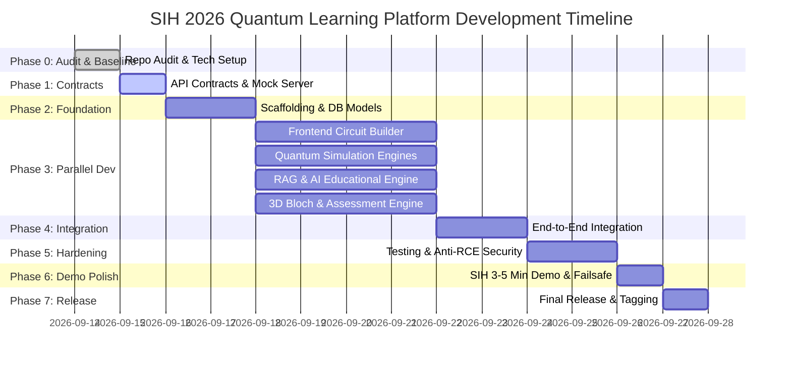

# Development Roadmap & Execution Schedule
## AI-Powered Interactive Quantum Algorithm Learning Platform (SIH 2026)

---

## 1. Roadmap Principles & Methodology

To ensure all 5 team members execute in parallel without merge conflicts, blocking dependencies, or hackathon crunch failures, the development timeline is structured across **8 sequential, dependency-aware phases**.

---

## 2. Phase-by-Phase Breakdown

### Phase 0: Repository Audit & Baseline Setup (Day 1)
* **Objective**: Audit existing files, establish environment standards, lock dependencies, configure team repository access.
* **Duration**: 1 Day
* **Member Assignments**:
  * **Lead / Member 5 (Saket Suman)**: Git branch structure, `.gitignore`, `.env.example`, Docker setup, base issue templates.
  * **All Members**: Local environment verification (Node.js 20+, Python 3.10+, Docker), clone repository, configure git remotes.
* **Expected Output**: Clean baseline repository with complete documentation, branch protection, and shared conventions.
* **Acceptance Criteria**:
  - `git clone` works seamlessly for all 5 team members.
  - No secret keys or build artifacts committed.
  - Dedicated branches initialized.
* **Git Branch**: `docs/project-roadmap` $\rightarrow$ merged to `main` and `develop`.

---

### Phase 1: Architecture, API Contracts & Mock Gateway (Day 2)
* **Objective**: Define concrete OpenAPI specifications and spin up a lightweight mock server so the frontend team can build UI components immediately without waiting for quantum or AI backend logic.
* **Duration**: 1 Day
* **Member Assignments**:
  * **Member 5 (Saket Suman)**: Initialize FastAPI skeleton, configure CORS, implement mock endpoints returning sample circuit simulation results and sample AI tutor responses.
  * **Member 1 (Prateek Raj)**: Scaffold Vite + React + Tailwind frontend, set up Axios client pointing to mock endpoints.
  * **Member 2 (Jayesh Kapoor)**: Finalize Unified Circuit Intermediate Representation (CIR) schema for quantum circuits.
  * **Member 4 (Apurva Sinha - AI Lead)**: Define structured JSON Master Orchestrator output schemas for AI RAG queries and dynamic quiz generation.
  * **Member 3 (Manas Thakur - Math Lead)**: Define verified mathematical formulations and LaTeX schemas for quantum states and operators.
* **Expected Output**: Runnable mock server at `http://localhost:8000/docs` with interactive Swagger UI.
* **Acceptance Criteria**:
  - Frontend makes test request to `/api/v1/simulation/run` and receives deterministic JSON payload.
  - All 5 team members sign off on API contracts.
* **Git Branch**: `feature/member-5-backend-devops`

---

### Phase 2: Foundational Scaffold & Core Pipeline (Days 3–4)
* **Objective**: Establish the database schema, user authentication, mathematical foundations, and basic visual layout.
* **Duration**: 2 Days
* **Member Assignments**:
  * **Member 5**: Implement SQLAlchemy models (Users, Circuits, Progress), JWT authentication endpoints (`/auth/register`, `/auth/login`), and SQLite session factory.
  * **Member 1**: Implement application shell, navigation bar, responsive layout, Three.js canvas container, and base Bloch Sphere mesh.
  * **Member 2**: Implement base quantum simulator abstraction and Qiskit 1.0+ Aer simulator wrapper.
  * **Member 3 (Manas)**: Research mathematical models for single and multi-qubit states, Dirac bra-ket notations, and unitary matrices for all 6 curriculum modules.
  * **Member 4 (Apurva)**: Implement hybrid RAG pipeline, ingest educational vectors into ChromaDB, and configure LLM gateway.
* **Expected Output**: Working login/signup, database persistence, mathematical formula library, and navigable app layout.
* **Acceptance Criteria**:
  - User can register, log in, and receive a signed JWT token.
  - Basic Bloch Sphere renders and rotates in the browser.
* **Git Branch**: `feature/*` branches merging into `develop`.

---

### Phase 3: Parallel Feature Development (Days 5–8)
* **Objective**: Core feature build-out across all independent functional tracks.
* **Duration**: 4 Days
* **Member Assignments**:

#### Track 1: Member 1 (Prateek - Frontend Lead) — Circuit Designer & Visualization
* Build drag-and-drop circuit canvas with multi-qubit support (up to 4 qubits).
* Add gate palette: $H$, $X$, $Y$, $Z$, $S$, $T$, $CX$ (CNOT), $CZ$, $SWAP$, Measurement.
* Real-time QASM / Python code exporter view.
* Animate Three.js Bloch Sphere vector based on simulation angles $(\theta, \phi)$ and render measurement histograms.

#### Track 2: Member 2 (Jayesh - Quantum Lead) — Multi-Engine Simulation
* Implement Qiskit Aer simulator for shot execution and statevector extraction.
* Implement PennyLane wrapper for variational algorithms (VQE, QAOA parameter updates).
* Implement Cirq adapter demonstrating multi-framework compilation.
* Build AST-based Python code validator (blocking forbidden imports).

#### Track 3: Member 4 (Apurva - Main AI Lead) — Educational Intelligence & RAG
* Lead the Master Prompt Orchestrator enforcing 2-sentence vocal script, LaTeX math, runnable code, and quiz generation.
* Build the Deterministic Failsafe Fallback Engine for offline hackathon demonstration resilience.
* Connect multi-provider LLM gateways (Groq / Gemini / Local fallback).

#### Track 4: Member 3 (Manas - Math & AI Co-Lead) — Mathematics Research & Ingestion
* Research and develop verified mathematical algorithms for Deutsch-Jozsa, Grover diffusion, and VQE Hamiltonians.
* Build mathematical validation rules ensuring AI-generated equations are mathematically coherent.
* Co-develop RAG vector knowledge base with Apurva: chunk, embed, and index textbook vectors.

* **Expected Output**: Four feature-complete modules ready for end-to-end wiring.
* **Acceptance Criteria**:
  - Dragging gates generates valid CIR JSON.
  - Backend executes CIR on Qiskit Aer and returns counts + statevector.
  - AI tutor responds with accurate quantum physics explanations, verified LaTeX formulas, and dynamic quizzes.
* **Git Branches**: `feature/member-1-frontend`, `feature/member-2-quantum`, `feature/member-3-math-ai-manas`, `feature/member-4-ai-lead`.

---

### Phase 4: System Integration & End-to-End Pipeline (Days 9–10)
* **Objective**: Connect frontend controls to real backend services and verify the complete user journey.
* **Duration**: 2 Days
* **Member Assignments**:
  * **Member 5 & 1**: Wire Circuit Designer to `/api/v1/simulation/run`.
  * **Member 1 & 2**: Pipe simulation statevector directly into Three.js Bloch Sphere and histogram charts.
  * **Member 4, 3 & 1**: Embed AI Quantum Tutor drawer alongside the circuit canvas with live mathematical equations.
  * **Member 5 & 4**: Connect quiz completion to user dashboard telemetry.
* **Expected Output**: Unified, fully interactive application executing live quantum circuits and rendering visual feedback in real time.
* **Acceptance Criteria**:
  - Modifying a circuit updates the Bloch sphere and histogram in $<500$ ms.
  - AI tutor answers questions about the active circuit state.
* **Git Branch**: Integration on `develop`.

---

### Phase 5: Verification, Testing & Security Hardening (Days 11–12)
* **Objective**: Comprehensive test execution, anti-RCE security audit, and performance tuning.
* **Duration**: 2 Days
* **Member Assignments**:
  * **Member 2**: Write unit tests for quantum circuits (Bell state, Superposition, Grover) verifying theoretical probabilities.
  * **Member 5**: Conduct penetration testing against code execution endpoints (verify malicious scripts like `import os` are blocked).
  * **Member 3**: Validate AI response formatting and latency.
  * **Member 1 & 4**: Cross-browser testing (Chrome, Firefox, Safari, Edge) and responsive layout checks.
* **Expected Output**: Clean Pytest report (>80% core backend coverage), green security audit, zero uncaught browser console errors.
* **Acceptance Criteria**:
  - All automated tests pass in CI (`pytest tests/`).
  - AST sandbox successfully intercepts and rejects unauthorized imports.
* **Git Branch**: `develop`.

---

### Phase 6: SIH 3–5 Minute Demo Polish & Offline Failsafe (Day 13)
* **Objective**: Optimize the end-to-end judging flow, script the presentation, and verify offline fallback resilience.
* **Duration**: 1 Day
* **Member Assignments**:
  * **Member 5 & 3**: Populate `./data/cached_simulations/` with pre-computed outputs for all 5 demo algorithms.
  * **All Members**: Dry-run the 3–5 minute presentation with network disabled to verify offline mode.
  * **Member 1**: Add quick-load "Preset Circuits" (Bell State, Grover Search, Deutsch-Jozsa) for 1-click demonstration during judging.
* **Expected Output**: Failsafe-enabled application guaranteed to function flawlessly under adverse network conditions.
* **Acceptance Criteria**:
  - Full demo runs from start to finish with Wi-Fi disabled without throwing any error pop-ups.
* **Git Branch**: `develop` $\rightarrow$ Pull Request to `main`.

---

### Phase 7: Final Release & Submission Readiness (Day 14)
* **Objective**: Merge release into `main`, tag version `v1.0.0-sih`, finalize video demonstrations and README documentation.
* **Duration**: 1 Day
* **Member Assignments**:
  * **Member 5**: Merge `develop` to `main`, tag `v1.0.0-sih`, verify Docker container build.
  * **All Members**: Final review of submission guidelines, PDF slide deck alignment, and repo cleanup.
* **Expected Output**: Production-ready GitHub repository tagged at `v1.0.0-sih`.
