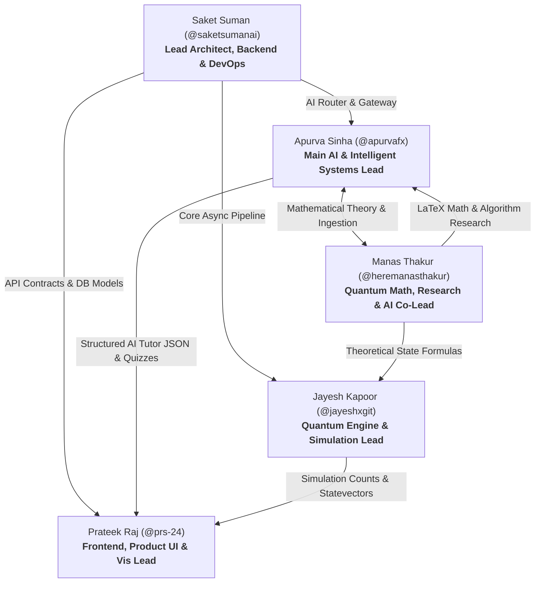

# Team Execution Plan & Role Allocation
## AI-Powered Interactive Quantum Algorithm Learning Platform (SIH 2026)

---

## 1. Team Structure Overview

The project is engineered by a team of **exactly 5 specialized engineers**. Ownership boundaries are strictly defined to prevent file lock-in, eliminate merge bottlenecks, and allow 100% parallel development.

---

## 2. Member Profiles & Detailed Responsibilities

### Member 4: Apurva Sinha (@apurvafx)
* **Primary Role**: **Main AI & Intelligent Systems Lead**
* **Secondary / Backup**: AI-Driven Assessment & Telemetry Orchestration
* **Dedicated Git Branch**: `feature/member-4-ai-lead`
* **Dedicated Workspace Paths**: `backend/app/services/ai/`, `backend/app/schemas/ai.py`, `backend/data/cached_simulations/`, `tests/test_ai_orchestrator.py`
* **APIs Owned / Implemented**: `/api/v1/ai-tutor/query`, `/api/v1/ai-tutor/generate-quiz`
* **Core Tasks**:
  1. Lead the overall AI architecture: design the Hybrid RAG pipeline combining local vector search with LLM generation.
  2. Implement the Master Orchestrator prompt pipeline enforcing:
     - Exactly 2 clear sentences of friction-free vocal prose (Deliverable 1).
     - Clean LaTeX mathematical formulas (Deliverable 4).
     - Runnable Qiskit/PennyLane/Cirq code snippets (Deliverables 2 & 3).
     - Dynamic 4-option multiple-choice quizzes (Deliverable 5).
     - Intent classification routing (`bloch_sphere`, `superposition`, `entanglement`, `grovers_algorithm`, `deutsch_jozsa`, `qaoa_vqe`).
  3. Build the Deterministic Failsafe Fallback Engine for offline hackathon demonstration resilience.
  4. Benchmark and integrate multi-provider LLM gateways (Groq / Gemini / Local fallback).
* **Acceptance Criteria**: Querying `/api/v1/ai-tutor/query` returns a validated JSON payload strictly conforming to the orchestrator schema in $<1.5$s on local CPU with zero hallucinations.

---

### Member 3: Manas Thakur (@heremanasthakur)
* **Primary Role**: **Quantum Mathematics, Theoretical Research & AI Co-Lead**
* **Secondary / Backup**: Textbook Vector Ingestion & Mathematical Verification
* **Dedicated Git Branch**: `feature/member-3-math-ai-manas`
* **Dedicated Workspace Paths**: `backend/data/curriculum/`, `backend/data/vector_store/`, `backend/app/services/ai/math_verifier.py`, `tests/test_quantum_math.py`
* **APIs Co-Owned / Implemented**: `/api/v1/curriculum/modules`, `/api/v1/curriculum/lessons/*`, `/api/v1/ai-tutor/*` (Math verification)
* **Core Tasks**:
  1. **Research in Mathematics & Quantum Theory**:
     - Formulate mathematical models for single and multi-qubit states (Dirac bra-ket notation, unitary matrices $U \in SU(2^n)$, tensor products $\mathcal{H}_1 \otimes \mathcal{H}_2$).
     - Formulate exact mathematical representations for all core algorithms: Deutsch-Jozsa oracle balance, Grover amplitude amplification diffusion operator ($2\lvert s \rangle\langle s \rvert - I$), and VQE Hamiltonian expectation values $\langle \psi(\theta) \rvert H \rvert \psi(\theta) \rangle$.
     - Build the verified raw LaTeX equation library used across State Visualization (Module 4) and AI Tutor outputs.
  2. **AI & RAG Co-Development (with Apurva)**:
     - Curate, chunk, and embed quantum computing textbooks, academic papers, and reference vectors into local ChromaDB.
     - Implement CPU sentence embeddings using `all-MiniLM-L6-v2`.
     - Implement automated mathematical validation ensuring AI-generated formulas and state vectors are mathematically coherent before emitting to the frontend.
* **Acceptance Criteria**: Mathematical equations for all 6 curriculum modules are mathematically verified without syntax errors, and the vector store provides relevant context retrieval with top-3 similarity score $> 0.82$.

---

### Member 1: Prateek Raj (@prs-24)
* **Primary Role**: **Frontend, Product UI & Visualization Lead**
* **Secondary / Backup**: Frontend State Management & Responsive Layout
* **Dedicated Git Branch**: `feature/member-1-frontend`
* **Dedicated Workspace Paths**: `frontend/src/features/circuit-designer/`, `frontend/src/features/visualization/`, `frontend/src/features/curriculum/`, `frontend/src/components/`, `frontend/src/store/`
* **APIs Consumed**: `/api/v1/simulation/*`, `/api/v1/ai-tutor/*`, `/api/v1/curriculum/*`
* **Core Tasks**:
  1. Build interactive drag-and-drop circuit canvas with multi-qubit grid and gate drop zones.
  2. Implement visual gate palette ($H, X, Y, Z, S, T, CX, CZ, SWAP, Measure$).
  3. Integrate interactive **Three.js 3D Bloch Sphere** with real-time statevector needle rotation and coordinate labels.
  4. Build dynamic measurement histograms and statevector amplitude bar charts.
  5. Create collapsible AI Tutor drawer with real-time KaTeX mathematical rendering and audio playback toggle.
  6. Develop responsive dark-mode layout and 1-click demo algorithm presets.
* **Acceptance Criteria**: Dragging gates updates the circuit canvas and Three.js Bloch Sphere at 60 FPS, with synchronized Qiskit Python code generation.

---

### Member 2: Jayesh Kapoor (@jayeshxgit)
* **Primary Role**: **Quantum Engine & Multi-Framework Simulation Lead**
* **Secondary / Backup**: Circuit Conversion & AST Sandbox Verification
* **Dedicated Git Branch**: `feature/member-2-quantum`
* **Dedicated Workspace Paths**: `backend/app/services/quantum/`, `backend/app/schemas/circuit.py`, `tests/test_quantum_engines.py`
* **APIs Owned / Implemented**: `/api/v1/simulation/run`, `/api/v1/simulation/statevector`, `/api/v1/simulation/algorithms/*`
* **Core Tasks**:
  1. Build Qiskit 1.0+ AerSimulator adapter executing circuit JSON with configurable shots.
  2. Implement statevector calculation and spherical coordinate conversion $(\theta, \phi)$ for Bloch sphere display.
  3. Build PennyLane simulator adapter for parameterized quantum circuits (VQE demo).
  4. Implement Google Cirq compiler interface demonstrating multi-vendor support.
  5. Implement Python AST code validator blocking unauthorized modules and preventing RCE.
* **Acceptance Criteria**: Circuit JSON executes cleanly across Qiskit Aer, returns correct counts (e.g. Bell state yields $\approx 50\%$ `00` and $\approx 50\%$ `11`), and AST sandbox rejects malicious scripts.

---

### Member 5: Saket Suman (@saketsumanai)
* **Primary Role**: **Senior Software Architect, Backend, Database, DevOps & Integration Lead**
* **Secondary / Backup**: Full-Stack Bug Fixing & Release Engineering
* **Dedicated Git Branch**: `feature/member-5-backend-devops`
* **Dedicated Workspace Paths**: `backend/app/main.py`, `backend/app/core/`, `backend/app/db/`, `backend/app/models/`, `Dockerfile`, `docker-compose.yml`, `.github/`
* **APIs Owned / Implemented**: `/api/v1/auth/*`, aggregate router, middleware, session management
* **Core Tasks**:
  1. Architect and enforce API contracts, OpenAPI schemas, and mock server endpoints.
  2. Implement SQLAlchemy ORM models, migrations, and SQLite/PostgreSQL configuration.
  3. Implement secure JWT authentication and route authorization guards.
  4. Build Docker containerization and Docker Compose orchestration.
  5. Lead end-to-end integration, resolve cross-branch merge conflicts, and execute test suites.
* **Acceptance Criteria**: Docker Compose launches full stack with single command (`docker-compose up`), API contracts pass validation, and test coverage exceeds 80%.

---

## 3. GitHub Task Breakdown Matrix (P0 / P1 / P2 / P3)

| Task ID | Title | Owner | Branch | Priority | Category | Dependencies |
| :--- | :--- | :--- | :--- | :---: | :---: | :--- |
| **TSK-01** | Repository Baseline & Doc Architecture | Member 5 (Saket) | `docs/project-roadmap` | **P0** | MUST HAVE | None |
| **TSK-02** | FastAPI Skeleton & Mock API Gateway | Member 5 (Saket) | `feature/member-5-backend-devops` | **P0** | MUST HAVE | TSK-01 |
| **TSK-03** | React + Vite Frontend Scaffolding | Member 1 (Prateek) | `feature/member-1-frontend` | **P0** | MUST HAVE | TSK-02 |
| **TSK-04** | Circuit Intermediate Representation (CIR) | Member 2 (Jayesh) | `feature/member-2-quantum` | **P0** | MUST HAVE | TSK-02 |
| **TSK-05** | Qiskit Aer Simulation Engine Driver | Member 2 (Jayesh) | `feature/member-2-quantum` | **P0** | MUST HAVE | TSK-04 |
| **TSK-06** | Drag-and-Drop Circuit Designer Grid | Member 1 (Prateek) | `feature/member-1-frontend` | **P0** | MUST HAVE | TSK-03, TSK-04 |
| **TSK-07** | Three.js 3D Bloch Sphere Component | Member 1 (Prateek) | `feature/member-1-frontend` | **P0** | MUST HAVE | TSK-03 |
| **TSK-08** | Measurement Histogram Chart Component | Member 1 (Prateek) | `feature/member-1-frontend` | **P0** | MUST HAVE | TSK-03 |
| **TSK-09** | Hybrid RAG Pipeline & Master Prompt Orchestrator | **Member 4 (Apurva - AI Lead)** | `feature/member-4-ai-lead` | **P0** | MUST HAVE | TSK-02 |
| **TSK-10** | Mathematical Theory & Dirac Formalism Modeling | **Member 3 (Manas - Math Lead)** | `feature/member-3-math-ai-manas` | **P0** | MUST HAVE | TSK-01 |
| **TSK-11** | Local Curriculum Vector Indexing & Embeddings | **Member 3 & 4 (Manas & Apurva)** | `feature/member-3-math-ai-manas` | **P0** | MUST HAVE | TSK-09, TSK-10 |
| **TSK-12** | Deterministic Offline Fallback Cache Engine | **Member 4 (Apurva - AI Lead)** | `feature/member-4-ai-lead` | **P0** | MUST HAVE | TSK-09, TSK-10 |
| **TSK-13** | End-to-End Simulation Pipeline Integration | All Members | `develop` | **P0** | MUST HAVE | TSK-05, TSK-06, TSK-09 |
| **TSK-14** | AST-Based Anti-RCE Code Sandbox | Member 2 (Jayesh) | `feature/member-2-quantum` | **P1** | MUST HAVE | TSK-05 |
| **TSK-15** | Interactive Quiz Engine & Telemetry Scorecard | Member 4 & 5 (Apurva & Saket) | `feature/member-4-ai-lead` | **P1** | MUST HAVE | TSK-03, TSK-09 |
| **TSK-16** | JWT Authentication & User Persistence | Member 5 (Saket) | `feature/member-5-backend-devops` | **P1** | SHOULD HAVE | TSK-02 |
| **TSK-17** | PennyLane Parameterized VQE Simulator | Member 2 (Jayesh) | `feature/member-2-quantum` | **P1** | SHOULD HAVE | TSK-05 |
| **TSK-18** | Google Cirq Simulator Integration | Member 2 (Jayesh) | `feature/member-2-quantum` | **P2** | SHOULD HAVE | TSK-05 |
| **TSK-19** | 1-Click Preset Demo Algorithms (Bell, Grover) | Member 1 (Prateek) | `feature/member-1-frontend` | **P1** | MUST HAVE | TSK-06 |
| **TSK-20** | Docker Compose Orchestration & CI Pipeline | Member 5 (Saket) | `feature/member-5-backend-devops` | **P1** | MUST HAVE | TSK-13 |
