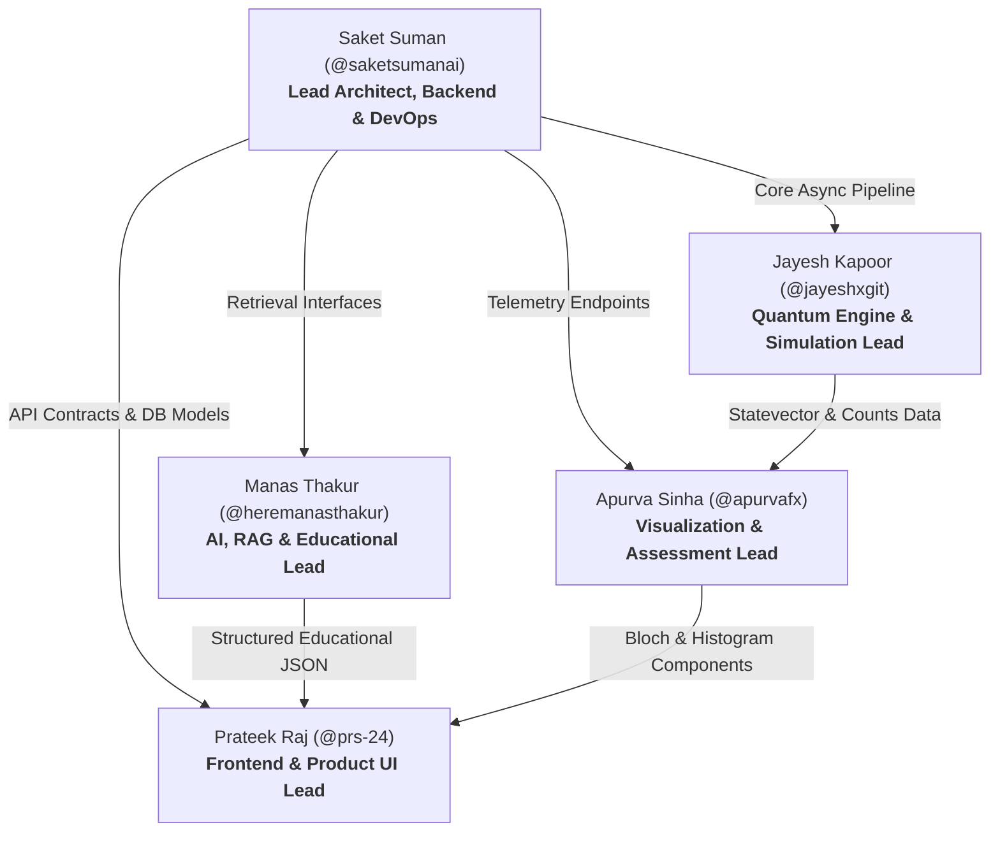

# Team Execution Plan & Role Allocation
## AI-Powered Interactive Quantum Algorithm Learning Platform (SIH 2026)

---

## 1. Team Structure Overview

The project is engineered by a team of **exactly 5 specialized engineers**. Ownership boundaries are strictly defined to prevent file lock-in, eliminate merge bottlenecks, and allow 100% parallel development.

---

## 2. Member Profiles & Detailed Responsibilities

### Member 1: Prateek Raj (@prs-24)
* **Primary Role**: Frontend & Product UI Lead
* **Secondary / Backup**: Frontend State Management & Visualization Integration
* **Dedicated Git Branch**: `feature/member-1-frontend`
* **Dedicated Workspace Paths**: `frontend/src/features/circuit-designer/`, `frontend/src/features/curriculum/`, `frontend/src/components/`, `frontend/src/store/`
* **APIs Owned / Consumed**: Consumes `/api/v1/simulation/*`, `/api/v1/curriculum/*`, `/api/v1/ai-tutor/*`
* **Core Tasks**:
  1. Build interactive drag-and-drop circuit canvas with multi-qubit grid and gate drop zones.
  2. Implement visual gate palette ($H, X, Y, Z, S, T, CX, CZ, SWAP, Measure$).
  3. Create code preview panel with syntax-highlighted Qiskit Python and OpenQASM export.
  4. Develop responsive layout with dark-mode aesthetic, collapsable tutor drawer, and presets bar.
* **Acceptance Criteria**: Dragging gates visually places them on the wire, automatically emits valid Circuit JSON, and updates Qiskit code preview instantly.

---

### Member 2: Jayesh Kapoor (@jayeshxgit)
* **Primary Role**: Quantum Engine & Multi-Framework Simulation Lead
* **Secondary / Backup**: Quantum Algorithm Verification & Circuit Conversion
* **Dedicated Git Branch**: `feature/member-2-quantum`
* **Dedicated Workspace Paths**: `backend/app/services/quantum/`, `backend/app/schemas/circuit.py`, `tests/test_quantum_engines.py`
* **APIs Owned / Implemented**: `/api/v1/simulation/run`, `/api/v1/simulation/statevector`, `/api/v1/simulation/algorithms/*`
* **Core Tasks**:
  1. Build Qiskit 1.0+ AerSimulator adapter executing circuit JSON with configurable shots.
  2. Implement statevector calculation and spherical coordinate conversion for Bloch sphere.
  3. Build PennyLane simulator adapter for parameterized quantum circuits (VQE demo).
  4. Implement Google Cirq compiler interface demonstrating multi-vendor support.
  5. Implement Python AST code validator blocking unauthorized modules and preventing RCE.
* **Acceptance Criteria**: Circuit JSON executes cleanly across Qiskit Aer, returns correct counts (e.g. Bell state yields $\approx 50\%$ `00` and $\approx 50\%$ `11`), and AST sandbox rejects malicious scripts.

---

### Member 3: Manas Thakur (@heremanasthakur)
* **Primary Role**: AI, RAG & Educational Intelligence Lead
* **Secondary / Backup**: Curriculum Content & Prompt Engineering
* **Dedicated Git Branch**: `feature/member-3-ai-rag`
* **Dedicated Workspace Paths**: `backend/app/services/ai/`, `backend/data/curriculum/`, `backend/data/vector_store/`, `tests/test_rag.py`
* **APIs Owned / Implemented**: `/api/v1/ai-tutor/query`, `/api/v1/ai-tutor/generate-quiz`
* **Core Tasks**:
  1. Ingest quantum textbook chapters and algorithm references into local ChromaDB.
  2. Implement CPU-friendly embedding generation using `all-MiniLM-L6-v2`.
  3. Build structured prompt orchestrator enforcing 2-sentence vocal script, LaTeX math, runnable code, and quiz item.
  4. Build offline deterministic fallback cache for top SIH topics (Superposition, Entanglement, Grover, Deutsch-Jozsa, VQE).
* **Acceptance Criteria**: Querying `/api/v1/ai-tutor/query` returns validated JSON payload conforming strictly to the orchestrator schema within 1.5s on local CPU.

---

### Member 4: Apurva Sinha (@apurvafx)
* **Primary Role**: Quantum Visualization, Assessment & Analytics Lead
* **Secondary / Backup**: Client Telemetry & Progress Dashboard
* **Dedicated Git Branch**: `feature/member-4-visualization-assessment`
* **Dedicated Workspace Paths**: `frontend/src/features/visualization/`, `frontend/src/features/assessment/`, `backend/app/api/v1/endpoints/telemetry.py`
* **APIs Owned / Implemented**: `/api/v1/assessment/*`, `/api/v1/telemetry/*`
* **Core Tasks**:
  1. Build interactive 3D Bloch Sphere in Three.js with animated statevector needle, coordinate labels, and rotation controls.
  2. Implement 2D statevector probability bar chart with dynamic phase angle color gradients.
  3. Create interactive measurement histogram displaying simulated shot frequencies.
  4. Build interactive quiz engine with instant answer verification, score tallying, and explanations.
* **Acceptance Criteria**: Bloch sphere rotates smoothly at 60 FPS, reacts instantaneously to state changes, and quizzes record mastery scores correctly.

---

### Member 5: Saket Suman (@saketsumanai)
* **Primary Role**: Senior Software Architect, Backend, Database, DevOps & Integration Lead
* **Secondary / Backup**: Full-Stack Bug Fixing & Release Engineering
* **Dedicated Git Branch**: `feature/member-5-backend-devops`
* **Dedicated Workspace Paths**: `backend/app/main.py`, `backend/app/core/`, `backend/app/db/`, `backend/app/models/`, `Dockerfile`, `docker-compose.yml`, `.github/`
* **APIs Owned / Implemented**: `/api/v1/auth/*`, aggregate router, middleware, session management
* **Core Tasks**:
  1. Architect and enforce API contracts, OpenAPI schemas, and mock server endpoints.
  2. Implement SQLAlchemy ORM models, migrations, and SQLite/PostgreSQL configuration.
  3. Implement secure JWT authentication and route authorization guards.
  4. Build Docker containerization and Docker Compose orchestration.
  5. Lead end-to-end integration, resolve cross-branch merge conflicts, and execute test suites.
* **Acceptance Criteria**: Docker Compose launches full stack with single command (`docker-compose up`), API contracts pass validation, and test coverage exceeds 80%.

---

## 3. GitHub Task Breakdown Matrix (P0 / P1 / P2 / P3)

| Task ID | Title | Owner | Branch | Priority | Category | Dependencies |
| :--- | :--- | :--- | :--- | :---: | :---: | :--- |
| **TSK-01** | Repository Baseline & Doc Architecture | Member 5 | `docs/project-roadmap` | **P0** | MUST HAVE | None |
| **TSK-02** | FastAPI Skeleton & Mock API Gateway | Member 5 | `feature/member-5-backend-devops` | **P0** | MUST HAVE | TSK-01 |
| **TSK-03** | React + Vite Frontend Scaffolding | Member 1 | `feature/member-1-frontend` | **P0** | MUST HAVE | TSK-02 |
| **TSK-04** | Circuit Intermediate Representation (CIR) | Member 2 | `feature/member-2-quantum` | **P0** | MUST HAVE | TSK-02 |
| **TSK-05** | Qiskit Aer Simulation Engine Driver | Member 2 | `feature/member-2-quantum` | **P0** | MUST HAVE | TSK-04 |
| **TSK-06** | Drag-and-Drop Circuit Designer Grid | Member 1 | `feature/member-1-frontend` | **P0** | MUST HAVE | TSK-03, TSK-04 |
| **TSK-07** | Three.js 3D Bloch Sphere Component | Member 4 | `feature/member-4-visualization-assessment` | **P0** | MUST HAVE | TSK-03 |
| **TSK-08** | Measurement Histogram Chart Component | Member 4 | `feature/member-4-visualization-assessment` | **P0** | MUST HAVE | TSK-03 |
| **TSK-09** | Local Curriculum RAG & Vector Index | Member 3 | `feature/member-3-ai-rag` | **P0** | MUST HAVE | TSK-02 |
| **TSK-10** | Deterministic Offline Fallback Cache | Member 3 | `feature/member-3-ai-rag` | **P0** | MUST HAVE | TSK-09 |
| **TSK-11** | End-to-End Simulation Pipeline Integration | All | `develop` | **P0** | MUST HAVE | TSK-05, TSK-06, TSK-07 |
| **TSK-12** | AST-Based Anti-RCE Code Sandbox | Member 2 | `feature/member-2-quantum` | **P1** | MUST HAVE | TSK-05 |
| **TSK-13** | Interactive Quiz Engine & Scorecard | Member 4 | `feature/member-4-visualization-assessment` | **P1** | MUST HAVE | TSK-03, TSK-09 |
| **TSK-14** | JWT Authentication & User Persistence | Member 5 | `feature/member-5-backend-devops` | **P1** | SHOULD HAVE | TSK-02 |
| **TSK-15** | PennyLane Parameterized VQE Simulator | Member 2 | `feature/member-2-quantum` | **P1** | SHOULD HAVE | TSK-05 |
| **TSK-16** | Google Cirq Simulator Integration | Member 2 | `feature/member-2-quantum` | **P2** | SHOULD HAVE | TSK-05 |
| **TSK-17** | 1-Click Preset Demo Algorithms (Bell, Grover) | Member 1 | `feature/member-1-frontend` | **P1** | MUST HAVE | TSK-06 |
| **TSK-18** | Multi-Qubit Statevector Color Compass | Member 4 | `feature/member-4-visualization-assessment` | **P2** | NICE TO HAVE | TSK-07 |
| **TSK-19** | Docker Compose Orchestration & CI Pipeline | Member 5 | `feature/member-5-backend-devops` | **P1** | MUST HAVE | TSK-11 |
| **TSK-20** | Audio Synthesis for Vocal Prose Script | Member 1 | `feature/member-1-frontend` | **P3** | NICE TO HAVE | TSK-09 |
