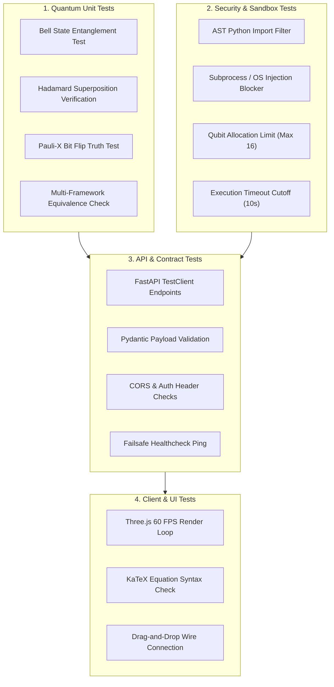

# Testing Strategy & Quality Assurance Plan
## AI-Powered Interactive Quantum Algorithm Learning Platform (SIH 2026)

---

## 1. Quality Objectives

In a hackathon judging environment, system crashes or unhandled exceptions during a live demonstration are fatal. This testing strategy ensures:
1. **Mathematical Truth**: Quantum simulation outputs strictly match theoretical quantum mechanics.
2. **Runtime Stability**: All edge cases, malformed circuits, and invalid inputs return structured JSON error envelopes rather than uncaught `500 Internal Server Error` crashes.
3. **Security Isolation**: Arbitrary Python code execution (RCE) attempts are intercepted and rejected at the AST level before touching the CPU.

---

## 2. Testing Levels & Matrix



---

## 3. Quantum Unit Test Specifications

### 3.1 Bell State Maximally Entangled Verification (`test_bell_state`)
* **Circuit**: $q_0 \xrightarrow{H} \bullet \xrightarrow{M}$, $q_1 \xrightarrow{} \oplus \xrightarrow{M}$
* **Theoretical Expectation**:
  $$P(\lvert 00 \rangle) = 0.5, \quad P(\lvert 11 \rangle) = 0.5, \quad P(\lvert 01 \rangle) = 0, \quad P(\lvert 10 \rangle) = 0$$
* **Acceptance Criteria**: Over 1024 shots, counts for `"00"` and `"11"` must both fall within $45\% - 55\%$. Counts for `"01"` and `"10"` must be exactly $0$.

### 3.2 Single-Qubit Superposition Test (`test_hadamard_superposition`)
* **Circuit**: $q_0 \xrightarrow{H} \xrightarrow{M}$
* **Theoretical Expectation**: $\lvert \psi \rangle = \frac{1}{\sqrt{2}}\lvert 0 \rangle + \frac{1}{\sqrt{2}}\lvert 1 \rangle$.
* **Acceptance Criteria**: Calculated Bloch vector coordinates must equal $(x=1.0, y=0.0, z=0.0)$ within a numerical tolerance of $\epsilon = 10^{-5}$.

### 3.3 Multi-Framework Cross-Validation (`test_framework_crosscheck`)
* Executes the identical 2-qubit circuit across **Qiskit Aer**, **PennyLane**, and **Cirq**.
* Verifies that all 3 frameworks produce mathematically consistent statevectors and probability distributions.

---

## 4. Security & Anti-RCE Sandbox Tests

### 4.1 Malicious Script Interception (`test_sandbox_malicious_code`)
Verify that the AST visitor rejects dangerous payloads:
```python
MALICIOUS_SNIPPETS = [
    "import os; os.system('rm -rf /')",
    "import subprocess; subprocess.Popen(['ls'])",
    "__import__('builtins').open('/etc/passwd').read()",
    "exec('import os')",
    "eval('2 + 2')"
]

@pytest.mark.parametrize("snippet", MALICIOUS_SNIPPETS)
def test_sandbox_blocks_malicious_code(snippet):
    validator = QuantumASTValidator()
    with pytest.raises(SecurityException):
        validator.validate(snippet)
```

### 4.2 Resource Starvation & Timeout Test (`test_simulation_timeout`)
* Submits a circuit that attempts an infinite loop or excessive gates.
* Confirms that the execution engine terminates after exactly 10.0 seconds and returns a clean `408 Request Timeout` HTTP error.

---

## 5. API Integration Tests

Utilizes FastAPI's built-in `TestClient` (backed by `httpx`):
* `test_health_endpoint`: Ensures `/api/v1/health` returns `200 OK` and reports all subsystems online.
* `test_simulation_run_endpoint`: Submits valid and invalid CIR JSON; asserts appropriate HTTP response codes (`200 OK` vs `400 Bad Request`).
* `test_ai_tutor_fallback`: Simulates network disconnection to LLM provider; verifies the system seamlessly returns the pre-compiled deterministic fallback payload without raising an unhandled exception.

---

## 6. Test Execution Commands

```bash
# 1. Run all backend unit & quantum tests
pytest tests/ -v

# 2. Run strictly quantum engine verification
pytest tests/test_quantum_engines.py -v

# 3. Run security and AST sandbox tests
pytest tests/test_security_sandbox.py -v

# 4. Generate coverage report
pytest --cov=backend/app --cov-report=term-missing tests/

# 5. Run frontend lint and tests
cd frontend && npm run test && npm run lint
```
